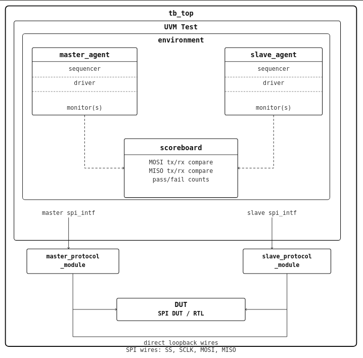

# SPI Verification

## 1. Project Overview

SPI stands for Serial Peripheral Interface. It is a synchronous serial full-duplex protocol commonly used for short-distance communication between microcontrollers, processors, sensors, memories, and other peripheral devices. 

This repository contains the verification environment of SPI protocol. This verification environment can:

- generate SPI traffic between master and slave sides
- drive `MOSI` from the master side and `MISO` from the slave side
- control `SS` so transfers occur only when the slave is selected
- generate `SCLK` according to the configured baud-rate parameters
- support randomized SPI polarity (`CPOL`) and phase (`CPHA`) settings
- compare transmitted and received data on both `MOSI` and `MISO`
- correctly handle single 8-bit transfers in the current verification scope

This repository does not include an SPI RTL block. The `master_protocol_module` and `slave_protocol_module` are connected to each other. This creates a loopback-style verification mode in which the master side generates SPI traffic and the slave side responds on the same shared SPI wires.

## SPI Master

SPI master drives `SS`, generates `SCLK`, transmits data on `MOSI`, and samples return data from `MISO`. In this repository, the master side is represented by a UVM master agent together with a protocol module that generates the serial clock based on the configured baud-rate parameters.

## SPI Slave

A slave responds only when selected through `SS`. It monitors the incoming clock and select signals, receives serial data on `MOSI`, and returns serial data on `MISO`.

## VIP Reuse

This VIP is reusable and can act as either side of an SPI connection depending on the DUT and the integration style:

- the VIP can be used as an SPI master when the DUT behaves like an SPI slave
- the VIP can be used as an SPI slave when the DUT behaves like an SPI master
- the VIP can be used as a whole(master/slave) depending on the design requirement.

## Baud Rate and Baud Divisor Calculation

The key parameters are:

- `SPR = 0`
- `SPPR = 0`
- `BAUD_RATE = 50000`
- `BAUD_DIVISOR = (SPPR + 1) * (2 ** (SPR + 1)) = 2`

In the clock-generation protocol module, the internal clock values are calculated as follows:

- `clk_freq = BAUD_RATE * BAUD_DIVISOR = 50000 * 2 = 100000`
- `clk_period = 1e6/clk_freq = 1e6/100000 = 10`
- `delay = clk_period/2 = 10/2 = 5`

## 3. Verification Architecture

Below is the architecture diagram for this project:

Key Components

- Master Agent: drives SPI master-side stimulus into the interface
- Slave Agent: provides SPI slave-side response behavior from the testbench
- Master Driver: converts sequence items into `SS` and `MOSI` activity and uses the generated clock
- Slave Driver: converts sequence items into `MISO` response activity
- Sequencers: supply transactions to the drivers
- MOSI Monitor: passively samples `MOSI` traffic
- MISO Monitor: passively samples `MISO` traffic
- Scoreboard: compares transmitted and received data from both directions
- Coverage Collector: not implemented yet in the current environment

## 4. SPI Signals

The signal list below summarizes the main bus signals relevant to this repository.

| Signal | Direction | Description |
| --- | --- | --- |
| `SCLK` | Master to Slave | Serial clock used to synchronize data transfer |
| `MOSI` | Master to Slave | Serial data sent from the master |
| `MISO` | Slave to Master | Serial data sent from the slave |
| `SS` | Master to Slave | Slave select signal, active low during transfer |

## 5. Test Suite

At present, the repository contains a single baseline test:

| Test Name | Description |
| --- | --- |
| `sanity_test` | Runs master and slave transmit sequences in parallel, inserts `SS` high, randomizes `CPOL` and `CPHA`, and checks single 8-bit data transfers on both `MOSI` and `MISO`. |

Future Work

- connect the VIP with DUT
- add coverage collection
- add directed tests for each SPI mode
- add longer and repeated transfer scenarios
- add error and corner-case checking around `SS` behavior and timing

## 6. How to Run

- Open ModelSim/QuestaSim
- `cd verification/sim`
- `do run.do`

The default test in `run.do` is `sanity_test`. To run a different test, change the `+UVM_TESTNAME=` argument in run.do file.
